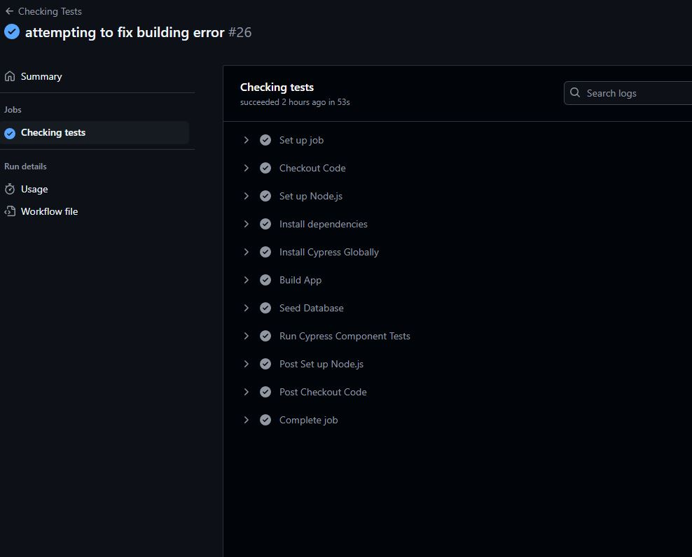
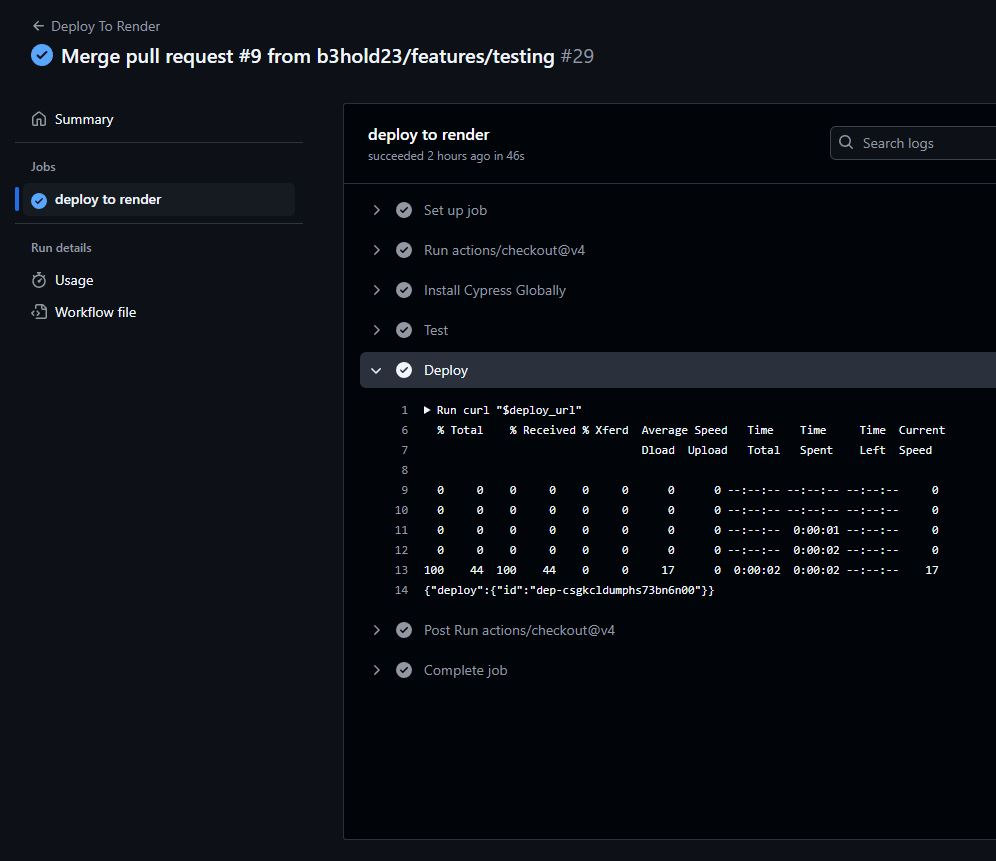

# Github Actions Challenge 

## Description
This project was to add github actions to the provided code to protect it from merge and deploying mistakes. 

## Table of Contents
- [Usage](#usage)
- [Credits](#credits)
- [License](#license)
- [Features](#features)
- [Contribute](#contribute)
- [Tests](#tests)

## Usage
This project will test the componets you are implementing then it will deploy the site once all tests pass.

## Features
There are two pages that will run before the page is redeployed with the new components. The first one is the checking tests page. 
 

 
Once this tests passes we will be able to deploy the page to render to update the site. (In the test section you can see the tests on GitHub)
 

## Tests
This is what the page will look like when all of the tests pass. 
 

Once all of the tests pass you will be able to merge it into the main branch and then it will deploy to Render
 

## My Info
My github:
 
b3hold23
 
My email: rosa.angel.daneil@gmail.com